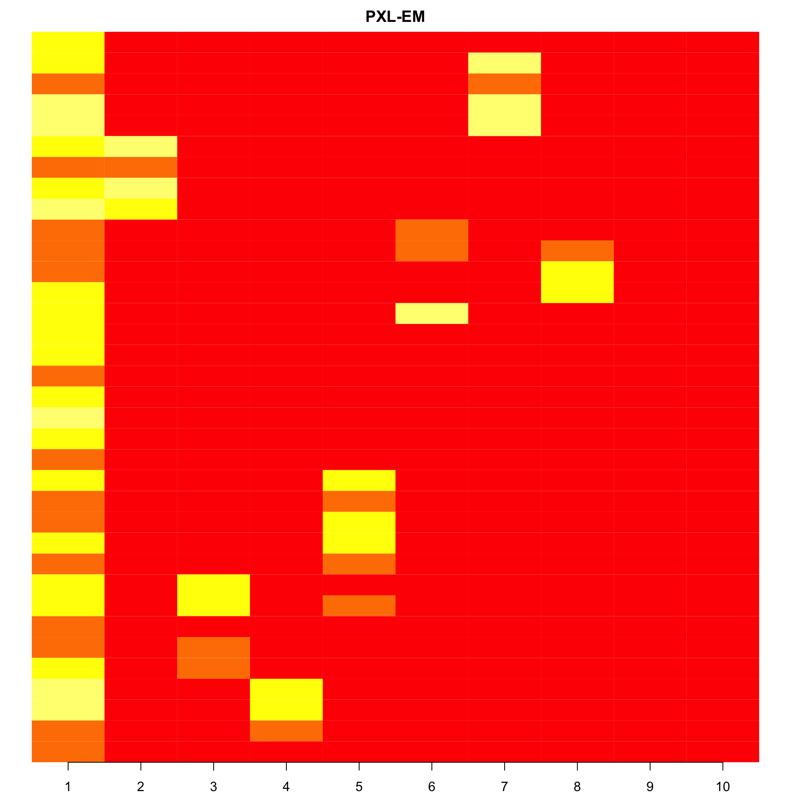
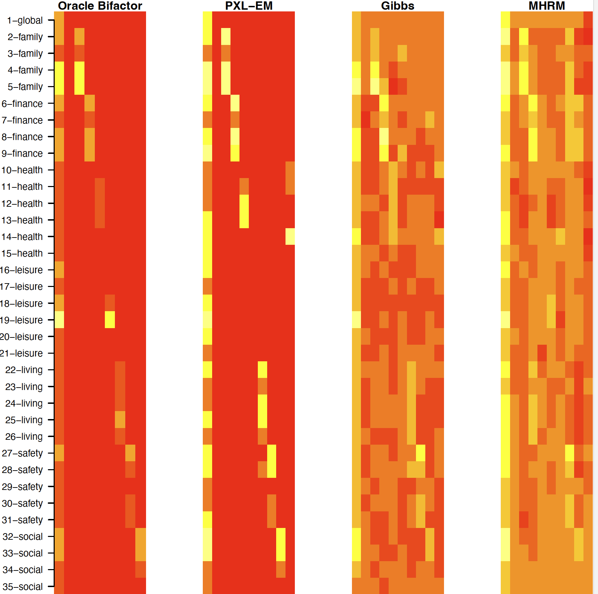

# Sparse Bayesian Multidimensional Item Response Theory

This repo contains the official R implementation of the PXL-EM algorithm to estimate sparse factor loadings from binary item response data, as illustrated in our paper *Sparse Bayesian Multidimensional Item Response Theory*. While we advocate for this Bayesian EM approach, we also publicize our Python implementation of the sparse Gibbs sampler (with Polya-Gamma Augmentation) for interested researchers.

In addition, we include relevant codes that can replicate every experiment described in our paper.

# Why Our PXL-EM Algorithm?

Here are the main reasons why our proposed Bayesian EM approach can be particularly advantageous for estimating sparse factor loadings from Multidimensional Item Response Theory (MIRT) models:

* **Computational Efficiency**: First, our proposed approach scales much better than MCMC sampling strategies. Unlike the E-step in MCEM or MHRM algorithms which resort to MCMC sampling and cannot be parallelized, we derive the posterior distribution of latent factors explicitly as a type of unified-skew normal distribution \cite{unified_skew_normal} \cite{Durante_2019} and are able to sample efficiently from the posterior using minimax tilting methods \cite{Botev_2016}. The sampling procedures in the E-step can be parallelized for each individual, and the M-step can also be decomposed into solving $J$ independent penalized probit regressions which can also be estimated efficiently with a standard Glmnet estimation algorithm \cite{glmnet}. Our empirical results show that the algorithm scales well with the numbers of observations, items, and latent dimensions.
* **Latent Dimensionality**: in an unconstrained exploratory MIRT setting, estimating the number of specified factors remains challenging due to the existence of multiple equivalent solutions. In consequence, the number of factors usually has to be specified arbitrarily before fitting the model. We propose to specify an Indian Buffet Process (IBP) prior \cite{ibp} on the loading matrix, which would allow the algorithm to automatically learn the dimensionality of factors from observed data. Researchers simply need to specify an arbitrarily large truncated level $K^*$ with very little computational cost.
* **Identification & Sparsity**: It is well known that factor analysis suffers from identification issues due to rotational indeterminacy of the loading matrix. In consequence, the estimated factor loading matrix of many exploratory MIRT models tend to be non-sparse and are difficult to interpret. The traditional approach to enhance interpretability is to apply a varimax rotation of the estimated solution \cite{varimax} after fitting the model. Similar to the approach in \cite{bfa}, we apply the spike-and-slab LASSO (SSL) prior of Ročková \cite{SSL} on the loading matrix, and combine it with an auxiliary rotation matrix induced from parameter expansion to encourage a sparse representation of factor loadings. This approach has the potential to alleviate the inherent identification issues of factor models and produce interpretable loading estimation. Furthermore, this approach can produce exact zeros, which does not need any additional step of thresholding required by MCMC sampling.
* **Robust Initialization**: EM-type algorithms tend to be sensitive to poor initialization and are prone to get stuck in local optimum. We add a factor rotation step after the M-step, which would accelerate EM convergence via parameter expansion. The addition of parameter expansion step allows the algorithm to explore the parameter space of equivalent observed data likelihoods faster and hence is more robust against poor initialization. One can further adjust the SSL prior to calibrate various initialization methods.   
* **Flexible Loading Structure**:  In contrast to the bifactor MIRT model, which enforces stringent orthogonality conditions among secondary factors, our unconstrained Bayesian estimation approach refrains from imposing such rigid structural assumptions on the factor loading matrix. As a result, our approach frequently identifies more intricate sparse solutions, as evidenced by numerous empirical examples outlined in the paper.


# Repo Directions

* **PXL-EM Algorithm**: Our R implementation of the PXL-EM algorithm can be found in ```project/probit_em_mirt.R```. Some potentially useful functions such as making predictions or computing loglikelihood can be found in ```project/probit_em_util.R```, which is not required to run ```probit_em_mirt.R```. To import the PXL-EM R script, in your R-script editor:
    ```r
    setwd("your_work_dirctory") # set working directory to where the probite_em_mirt.R script is
    source("probit_em_mirt.R")
    source("probit_em_util.R")
    ```
* **Sparse Gibbs Sampler**: Our Python implementation of the sparse Gibbs sampler can be found in ```src/bayesian_mirt/mcmc_sampler/mcmc_mirt.py```. You are welcome to use this script directly to fit our Gibbs Sampler for your applications, or you can also try to download this as a python package in your virtual environment: 
    ```bash
    python setup.py install
    pip install -e .
    ```
    Then in your python script editor:
    ```python
    import bayesian_mirt as bmirt
    ```
* **Experiment Replications**: If you are interested in replicating the experiment results of our PXL-EM algorithm in our paper:
  * **IBP Loading Experiment**: check script ```project/synthetic_data_experiments/s02_probit_em_ibp.R```. The corresponding folder contains scripts to fit the Gibbs sampler, the mhrm algorithm, and the bifactor models.
  * **DESE Experiment**: check script ```project/dese_experiment/s02_fit_dese_data.R```. The corresponding folder contains scripts to fit the Gibbs sampler, the mhrm algorithm, and the bifactor models. Note you may need to run ```s01_process_dese_data.R``` before fitting the PXL-EM algorithm, which preprocesses and samples raw DESE dataset.
  * **QOL Experiment**: check script ```project/qol_experiment/s01_em_qol.R```. The corresponding folder contains scripts to fit the Gibbs sampler, the mhrm algorithm, and the bifactor models.
  
# PXL-EM Algorithm Usage Examples & Advice

We provide a detailed guidance on how to apply our sparse Bayesian MIRT approach, the PXL-EM algorithm, to your particular binary factor analysis applications. To achieve this, we will provide step-by-step instructions in order to replicate the Quality-of-life measurement experiment in our paper. 

This QOL dataset comprises responses from $586$ individuals with chronic mental illnesses, who answered $35$ items related to their life satisfaction across seven distinct subdomains (Family, Finance, Health, Leisure, Living, Safety, and Social). Given the presence of a global life satisfaction item that can serve as the primary factor, Gibbons et al. \cite{bifactor_graded} showcased the advantages of the bifactor model in a confirmatory analysis. In their study, items associated with each subdomain loaded on separate secondary latent factors as well as the primary quality-of-life factor. 

We will assess whether our unconstrained PXL-EM algorithm can unveil a similar latent structure to that of the bifactor model, even without any external guidance. This particular instance presents a significant challenge, as the algorithm must learn an $8$-dimensional latent space (inclusive of the primary component) from a mere $35$ available items. In the confirmatory analysis of Gibbons, factor loading structures are predefined by experts, here our exploratory analysis received no such information but the item response data.

To better understand these instructions, we invite readers to read the modeling section of our paper, as well as the idea of "Dynamic Posterior Exploration", in which we keep the spike-and-slab LASSO penalty parameters $\lambda_1$ at a reasonable value, and gradually increase the values of $\lambda_0$ for better calibration.

##  Code Example: Replicating QOL Experiment in Our Paper

First set your working directory to where the file ```probit_em_mirt.R``` is. Then load necessary packages. Modify ```data_input_dir```  to the directories where you stored the ```QOL.txt``` data.  Modify ```model_output_dir``` to the directories where you intend to save the PXL-EM model. You can download the QOL dataset from the directory ```data/qol/QOL.txt```

It's worth noting that while the original QOL dataset utilized a seven-point ordinal scale, we transformed it into binary responses by dichotomizing between $4$ and $5$, aligning with our proposed approach's focus on binary response data. Here ```dicho_threshold``` represents the dichotomization threshold to transform ordinal data to the binary data. 
```r
setwd("your workding directory")
source("probit_em_mirt.R")
source("probit_em_util.R")
library(pacman)
p_load("tidyverse", "argparser", "dplyr", "magrittr", "here", "hash")

# parse arguments
arguments <- arg_parser("FIT QOL data") %>% 
  add_argument(
    "--data_input_dir", 
    help= "data_input_dir", 
    default= here("data", "qol")
  ) %>%
  add_argument(
    "--model_output_dir", 
    help= "model_output_dir", 
    default= here("models", "qol")
  ) %>%
  add_argument(
    "--dicho_threshold", 
    help= "how to dichotomize data", 
    default= 4
  ) %>%
  parse_args()

# read data and convert to binary response
lines <- readLines(file.path(arguments[["data_input_dir"]],"QOL.txt"), warn=FALSE)
cleaned_lines <- trimws(lines, "both")
data <- data.frame(cleaned_lines, stringsAsFactors = FALSE)
data <- data %>%
  tidyr::separate(col = cleaned_lines, into = paste0("col", 1:35), sep = 1:34, convert = TRUE)
binary_response <- +(data > arguments[["dicho_threshold"]]) %>% as.matrix() %>% unname()
```
Once we transform the raw QOL data to the binary response data, we will be ready to fit our PXL-EM algorithm. Here:
* ```lambda1```: $\lambda_1$ parameter for the SSL prior. It's usually easier for EM to convergence by specifying a smaller value.
* ```Lambda0_path```: is the $\lambda_0$-path for dynamic posterior exploration. The key is to start with the same value as $\lambda_1$ and gradually increase the $\lambda_0$ values until convergence.
* ```large_k```: serves as an upper bound of our guess on the latent dimensionality (true dimensionality is 8, here we are guessing it's not more than 10, which is reasonable guess for mere 35 items).  
* ```loading_start_large```: random staring positions of the model parameters. ```alphas``` represents the loading matrix, for which it's recommended to start with small positive values, as MIRT models generally have positive loadings. ```intercept``` represents the intercept parameters for the 2PL-MIRT model. ```c_params``` represents the ordered inclusion probabilities for each column of the loading matrix, starting with probabilities a half generally works fine.
* ```dynamic_posterior_exploration``` is the main function fitting our PXL-EM algorithm. Internally, it calls the function ```probit_em_mirt``` function for each value of $\lambda_0$ along the ```lambda0_path``` until convergence.

It took me about 411 seconds to fit our PXL-EM algorithm on my MacBook Pro. 
```r
# fit px-em
lambda1 <- 0.1
lambda0_path <- c(0.1, 0.5, 1, 5, 10, 20, 30, 40)
large_k <- 10
nitems <- 35
set.seed(1)
loading_starts_large <- hash("alphas"= matrix(runif(nitems*large_k, 0, 0.1), nitems, large_k),
                             "intercepts"= runif(nitems , -0.1,0.1), "c_params" = rep(0.5, large_k))
px_em <- dynamic_posterior_exploration(data =binary_response, k = large_k, ibp_alpha = 2, mc_samples =50,
                                       ssl_lambda0_path = lambda0_path, ssl_lambda1 = lambda1, pos_init =TRUE,
                                       max_iterations= 100, epsilon = 0.04, PX = TRUE, varimax = FALSE,
                                       loading_constraints= NULL, start = loading_starts_large,
                                       plot=FALSE, stop_rotation=100, random_state = 1, cores=8)

```
If you want to visualize the estimated factor loading matrix, you can run the function below to plot the loading matrix:
```r
plot(px_em$lambda0_40$alphas, main= "PXL-EM", key=NULL,  axis.row=NULL, axis.column = NULL,  xlab='', ylab='', border=NA) 
```



If you reorder the column, you will get the same plot in our paper. If you fit a sparse gibbs sampler (see script ```project/qol_experiment/s02_gibbs_qol.py```) or the MHRM algorithm of Cai (see script ```project/qol_experiment/s03_mhrm_qol.R```), you will get loading matrices visualized as below (copied from our paper). The plot highlights the advantage of our PXL-EM algorithm over the other existing exploratory factor analysis strategies, which can produce sparse and interpretable loading estimations that can mirror the oracle bifactor model. Unlike the bifactor model which requires predefined factor loading matrix, we emphasize again our PXL-EM algorithm does not require any external guidance, and can learn the loading structure from the binary item response data. We invite interested readers to check out our paper to learn more about the discussions on this QOL experiment.



## Function Documentation


# Appendix: Sparse Gibbs Sampler Usage Examples & Advice

# Reference